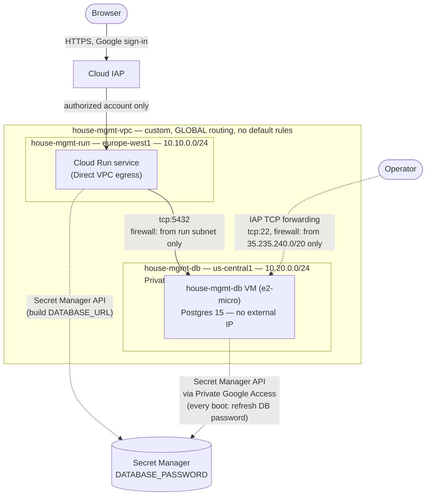

# Architecture

Whole-system map for the Phase 1 MVP scaffolding (`docs/prds/production-v1-prd-200926.md`).
Points to ADRs/specs for full reasoning rather than restating it.

## Components

- **`app/frontend`** — Vite/React/TypeScript single-page app. A form
  submits an issue and shows a thinking/success/needs-info/error state per
  the agent's outcome (its full research findings and any contractors
  found, not just the headline cost), plus a table of previously saved
  issues loaded on mount and refreshed after each submit, with a
  Contractor Y/N column. A right-hand column shows the latest news feed
  articles (`GET /api/news-feed`), fetched once on mount. `vitest` +
  `@testing-library/react` for tests.
- **`app/backend`** — FastAPI. Routers (`routers/`) handle HTTP; services
  (`services/`) hold the actual logic — the agent loop (`services/agent.py`),
  the issues database layer (`services/issues_db.py`), rate limiting,
  Langfuse config, IAP identity verification, and shared DB credential
  resolution (`services/db_connection.py`, used by both the Service and
  the news feed Job below). `pytest` for tests, with an `eval` marker
  (real LLM calls, see ADR-003) separating them from the default fast run.
  DB-backed tests need the local Postgres from the repo-root
  `docker-compose.yml` (`docker compose up -d`; setup in `README.md`).
  In production, also serves the frontend's built static files
  (`fastapi.staticfiles`) from a single Docker image/Cloud Run service —
  there is no separate frontend server in production. Genuine full-stack
  e2e tests (real browser, against Postgres + the backend + the frontend
  all actually running locally, via `agent-browser`) live separately in
  `app/tests/` — costs money and hits real external sites; run explicitly
  (`pytest -m e2e app/tests -s`), never in CI.
- **The maintenance agent** (`app/backend/services/agent.py`) —
  `run_agent()`: a ReAct loop (OpenRouter, Mercury 2.5) with five tools —
  `research_cost`/`find_contractors` (web-search sub-calls),
  `save_cost_estimate`/`save_contractors` (independent — either, both, or
  neither, based on what the request actually asks for), and
  `save_clarifying_question`. `save_cost_estimate`/`save_contractors`
  accumulate into the run rather than ending it; the run ends when the
  model stops calling tools (or hits `MAX_ROUNDS`), at which point one
  `AgentOutcome` is written via an injected `save` function (production
  passes `issues_db.save`; evals pass a capturing function, so assertions
  run against the returned `AgentOutcome` before any DB write).
  `save_clarifying_question` stays all-or-nothing: it ends the run
  immediately and discards anything already accumulated. A runtime `failed`
  write covers provider errors or empty responses; a run that ends with
  nothing accumulated falls back to `needs_info` rather than `failed`. See
  ADR-005 for the contractors/agent-loop reasoning and
  `docs/specs/spec-architecture-research-cost-agent-and-issues-db-280926.md`
  for the original cost-estimate design and REQ-by-REQ status.
- **The conversation agent** (`app/backend/services/conversation_agent.py`) —
  a second, deliberately separate ReAct loop (`run_conversation_turn()`) for
  bounded follow-up Q&A on an already-submitted issue, introduced by the
  multi-turn conversation slice. It is not a mode of `run_agent()`: that
  loop's invariant is "every run ends with exactly one `save_*` call," which
  is incompatible with a conversational turn, where ending on plain text
  with no tool call is the normal case, bounded only by the 10-user-turn
  cap enforced at persistence (`issues_db.append_step`'s
  `ConversationCapReached`). The two loops share only what carries no
  task-specific invariant — the model constant and traced client builder
  from `agent.py` — and reuse tool *implementations* (the
  `research_cost`/`find_contractors` web-search sub-calls) directly from
  `agent.py` rather than duplicating them; only the loop/termination/prompt
  shape is duplicated, by design. This mirrors how major agent frameworks
  already draw this line (Assistant/Thread-vs-Run separation, tools kept
  reusable apart from the orchestrator loop) — see ADR-007 for the full
  reasoning, sources, and why this exact friction is expected to recur as
  agent functionality grows, likely forcing a wider refactor (a shared loop
  runner) once a third structurally-different workflow shape appears.
- **The issues database** — Postgres on a dedicated, free-tier Compute
  Engine VM, reachable only over a private VPC (see the network diagram
  below). `services/issues_db.py`: `init_schema()` (run once, on app
  startup, via a FastAPI lifespan handler), `save()`, `list_issues()`.
  `contractors` and `issue_contractors` (a many-to-many join table) hold
  the agent's contractor picks — `save()` upserts a contractor by name and
  links it to the issue; `list_issues()` exposes a computed
  `has_contractor` per issue. `conversations` and `conversation_steps`
  (`create_conversation()`, `append_step()`, `get_conversation_steps()`)
  hold the per-issue follow-up conversations introduced in the multi-turn
  slice. A *turn* is one user message plus everything the agent does in
  response to it; a *step* is one row — the user message, an assistant
  tool-call, a tool result, or the final assistant reply — tagged with the
  `turn_number` it belongs to (derived in `append_step`, not passed in: a
  count of user steps so far). This distinction matters beyond naming —
  the Langfuse trace hierarchy (ADR-007; build step 7) and the frontend
  thread view (build step 8) both group by `turn_number`, nesting a turn's
  steps under it, rather than re-inferring turn boundaries from a flat
  list. Each conversation is FK-bound to one issue, and `append_step`
  enforces a 10-user-turn cap (`ConversationCapReached`) by counting
  `role = 'user'` steps. These tables live in `issues_db.py` rather than a
  module of their own, unlike `articles`
  (below): they have no independent lifecycle or populating process of
  their own — they're part of an issue's own data graph, the same reason
  `contractors`/`issue_contractors` live here instead of a separate
  `contractors_table.py`. See ADR-004 for the hosting/network/
  credential-resolution reasoning, ADR-005 for the contractors data model,
  and `docs/specs/multi-turn-conversation-brief-spec-061026.md` for the
  conversations design.
- **The news feed** — `app/backend/jobs/pull_news_feed.py`, a Cloud Run Job
  (`infra/news_feed_job.tf`) triggered by Cloud Scheduler every 2 days, pulls
  NRLA (`services/news_data_pull.py`, server-rendered HTML) and Tenancy
  Deposit Scheme (sitemap XML — its `/news` page is a client-rendered SPA
  with nothing server-side to pull) articles published since
  `--lookback-days` (default 2), and upserts them into the `articles` table
  (`services/articles_table.py`, `ON CONFLICT (url) DO NOTHING`). Commits
  per source: one source failing doesn't lose the other's data that run;
  the Job exits non-zero if either source failed. Shares the Service's
  Cloud Run image with an overridden container command, not a second
  Dockerfile; CI/CD updates both on every deploy to `main`. `GET
  /api/news-feed` (the Service, read-only) returns the latest 10,
  newest-first. See ADR-006 for the topology decision and alternatives
  considered.
- **`infra/`** — Terraform. Provisions Cloud Run, Artifact Registry, Secret
  Manager, IAP + its IAM bindings and audit logging, GitHub Actions'
  Workload Identity Federation, and (as of 29 Sep) the issues-DB VM and its
  dedicated VPC. See `infra/README.md` for the bootstrap sequence
  (including the one-time manual steps Terraform can't do, and the DB VM's
  two-apply bootstrap dance) and ADR-001/ADR-002/ADR-004 for the reasoning.
- **`.github/workflows/ci-cd.yml`** — lint/typecheck → unit tests (with a
  Postgres service container) → Docker build → (on push to `main` only)
  deploy to Cloud Run. See ADR-001.
- **`prototypes/`** — throwaway prototyping, explicitly not production
  code (see `prototypes/README.md`). `services/agent.py`'s real tools and
  system prompt were built from these prototypes' proven patterns
  (cost-research prompt, write-tool-ends-the-loop shape), not a direct
  port.

## Request flow (production)

1. Browser requests the Cloud Run URL.
2. **IAP** (Cloud Run native integration) intercepts the request before it
   reaches the container, for every path. Not authenticated yet → redirect
   to Google sign-in. Authenticated but not the authorized owner account →
   403, request never reaches the app. See ADR-002 for the full mechanism
   and why this holds even with the source fully public.
3. Authorized request reaches FastAPI. A middleware logs the verified
   caller identity (from the `X-Goog-IAP-JWT-Assertion` header) for
   observability — this is logging only, not an access-control decision;
   that decision was already made in step 2.
4. `GET /` (or any non-API path) → static frontend files. `POST /api/issue`
   → rate-limited (per-IP), 2000-character-capped issue text → `run_agent()`
   (`services/agent.py`), traced as a single Langfuse `run_agent` span
   nesting every model/tool call. The agent researches a cost estimate,
   finds contractors, both, or asks a clarifying question — whichever the
   request actually calls for — writes exactly one row to the issues
   database via `issues_db.save()`, and the resulting outcome is returned
   as the response — the row (and any linked contractors) is already saved
   by the time the HTTP response arrives, not written separately by the
   router. `GET /api/issues` lists
   all saved issues, newest first; the frontend calls this on mount and
   again after every submit. `GET /api/news-feed` similarly lists the
   latest 10 articles, newest first — read-only; nothing in the Service
   ever writes to the `articles` table, only the news feed Job (see
   Components above) does.
5. Reaching the issues database: Cloud Run has Direct VPC egress into a
   dedicated private subnet: see the network diagram below.

## Network (Cloud Run ↔ issues database)

The DB VM has **no permanent external IP** — external IPv4s cost money
while attached, and the only genuine need for one is the VM's one-time
`apt-get install postgresql` at first boot (Debian's package mirrors
aren't a Google API, so Private Google Access doesn't cover them). That
IP is attached only for a deliberate one-time bootstrap apply
(`var.db_vm_bootstrap_internet_access`, see `infra/README.md`), then
removed; everything the VM does afterward (the every-boot password
refresh) goes over free Private Google Access instead. See ADR-004 for
the full reasoning, including the alternatives considered (Cloud SQL, the
auto-created `default` network, Cloud NAT).

## Deploy flow

Terraform provisions everything except the deployed app image itself
(`lifecycle.ignore_changes` on the Cloud Run image field). A push to `main`
triggers GitHub Actions: build the Docker image (bundles the frontend build
into the backend's static files, see `app/backend/Dockerfile`), push to
Artifact Registry, `gcloud run deploy` to update the image on the
Terraform-provisioned service, then check the new revision's readiness
condition. `gcloud run deploy --image=...` only ever touches the `image`
field — it's a partial update, not a full service replace, so it never
reverts `vpc_access`/env vars/etc. that Terraform manages, and Terraform's
`ignore_changes` means a later `terraform apply` never reverts the image
CI/CD just deployed either; the two systems cleanly own different fields
of the same Cloud Run service. See ADR-001 for why `terraform apply`
itself never runs in CI/CD, and ADR-002 for why deploy doesn't run an
authenticated HTTP smoke test.
